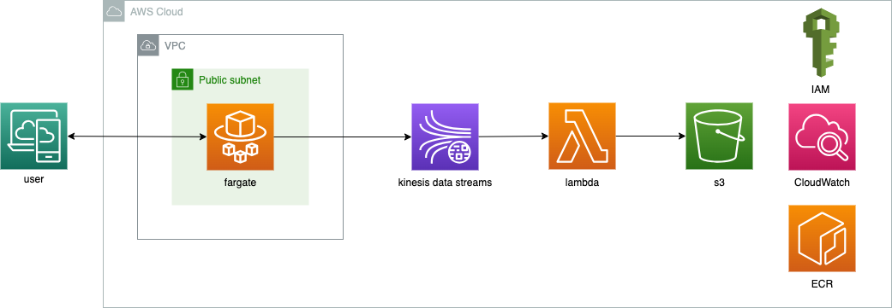

# Kinesis data streams、lambda、S3を活用したWebアプリのリアルタイムデータ解析基盤構築

<p align="center">
  
</p>


# 概要

ここでは、Amazon Web Services (AWS) を利用して、Webアプリケーションのリアルタイムデータを収集・分析するためのデータ分析基盤を構築する方法を説明します。

1. ユーザーがWebアプリケーションにアクセス
2. アプリケーションは、ユーザーの行動やイベントに関するデータを生成し、Kinesis Data Streams に送信
3. データは Kinesis Data Streams によってリアルタイムでストリーミングされ、バッファリングします
4. AWS Lambda 関数は、Kinesis Data Streams からの新しいデータのバッチに対してトリガーします
5. Lambda 関数は、データの検証、変換、エンリッチメントなどの処理を実行します
6. 処理されたデータは、長期保存のために Amazon S3 バケットに保存されます

# 目的
Webアプリのリアルタイムデータを収集し、効率的に分析するための基盤を構築します。

# 機能一覧
+ データ収集機能

# アーキテクチャ

本基盤は、以下のAWSサービスで構成されています。

+ Amazon S3: 収集したデータを格納するためのオブジェクトストレージサービス
+ Amazon ECS Fargate: コンテナ化されたアプリケーションを無サーバーで実行するためのコンテナーオーケストレーションサービス
+ Amazon ECR: コンテナイメージを保存するためのプライベートレジストリサービス
+ AWS IAM: ユーザーとリソースへのアクセスを制御するためのアイデンティティとアクセス管理サービス
+ AWS Lambda: コードを実行するためのイベント駆動型コンピューティングサービス
+ Amazon Kinesis Data Streams: リアルタイムのデータストリームを処理するためのストリーミングサービス


# 起動とデプロイ方法
1. 以下のコードを実行すると実行
```
bin/terraform_apply
```

# 停止方法
以下のコードを実行すると実行されます。
```
bin/terraform_destroy
```

# 結果

s3に以下のCSVが作成されました。

<p align="center">
  
</p>


# Qiita記事

技術詳細はQiitaに記載しています。

[Kinesis data streams、lambda、S3を活用したWebアプリのリアルタイムデータ解析基盤構築](https://qiita.com/sugiyama404/items/dcd44098fb19ebd8d411)


